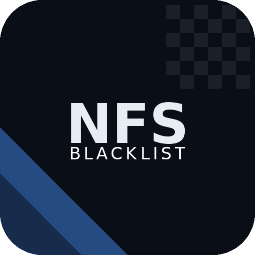

  

Automated setup for classic Black Box Need for Speed games on Steam Deck and Linux handhelds.

NFSBlacklist detects your game files, installs community fixes, creates Proton prefixes, and adds non-Steam shortcuts with controller profiles — so you can boot into Game Mode and just play.

## Supported Games

- Need for Speed: Underground (2003)
- Need for Speed: Underground 2 (2004)
- Need for Speed: Most Wanted (2005)
- Need for Speed: Carbon (2006)

## Supported Devices

- Steam Deck (LCD & OLED)
- Lenovo Legion Go / Go S / Go 2
- ROG Ally / Ally X
- MSI Claw 8
- Steam Machine
- General PC (SteamOS, Bazzite, CachyOS)

## What It Does

**You provide the game files.** These titles were never sold on digital stores. NFSBlacklist does not download games — it sets them up for you once you have them.

- Detects and validates your game installs
- Downloads GE-Proton and creates prefixes
- Installs community widescreen and compatibility fixes
- Writes display configs tuned to your device
- Creates non-Steam shortcuts with artwork
- Assigns controller profiles with a racing-optimized layout

## Project Status

Early development. Currently not playtest worthy.

---

## Credits

Steam artwork from [SteamGridDB](https://www.steamgriddb.com) - thanks to [atmur](https://www.steamgriddb.com/profile/76561198100942529), [Bcoder](https://www.steamgriddb.com/profile/76561198042209011), [DustinEden](https://www.steamgriddb.com/profile/76561198053432620), [EthanBB](https://www.steamgriddb.com/profile/76561198032970704), [FrostWolf](https://www.steamgriddb.com/profile/76561198319892674), [Haxy](https://www.steamgriddb.com/profile/76561198205566017), [iixCarbonxZz](https://www.steamgriddb.com/profile/76561198074871945), [Luqgreg](https://www.steamgriddb.com/profile/76561198211811416), [mdante_ar](https://www.steamgriddb.com/profile/76561198148269891), [r_dsgnd](https://www.steamgriddb.com/profile/76561198355292092), [yst](https://www.steamgriddb.com/profile/76561198095634087), and [☆](https://www.steamgriddb.com/profile/76561198963120555).

**[Claude](https://claude.ai)** by Anthropic - assisted in development.

---

> NFSBlacklist is not affiliated with Electronic Arts, EA Black Box, or Valve. All trademarks belong to their respective owners. NFSBlacklist does not provide or distribute game files.

## License

[MIT License](LICENSE)
